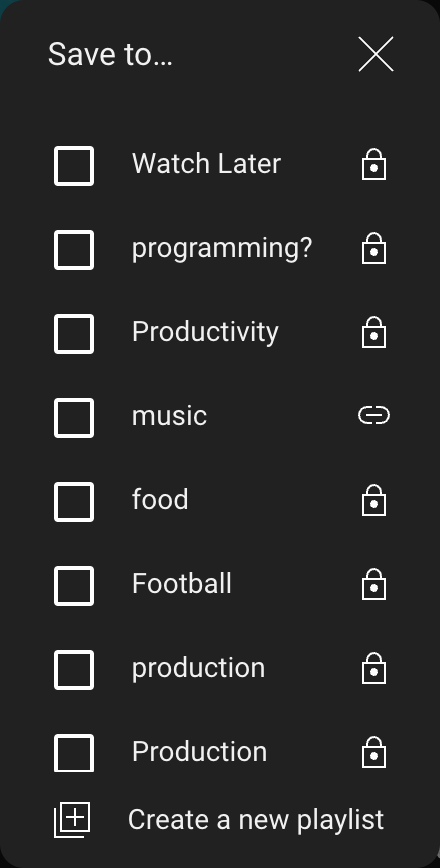
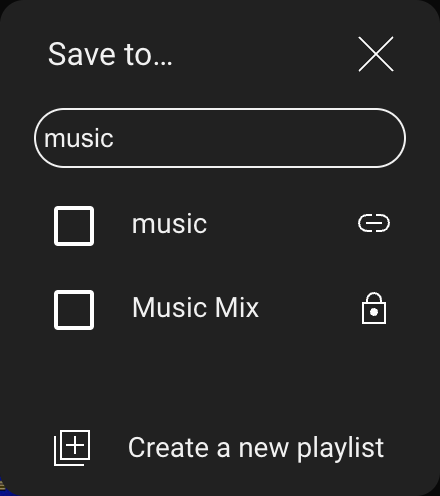

## Playlist Search

For users with many Youtube playlists, finding the right playlist for a video they want to save is a pain. They have to scroll through a seemingly endless stream of playlist names, trying to find a playlist entitled "Cat Videos". This simple Chrome extension solves that problem, by adding a search bar to the save into playlist dialog on Youtube.

